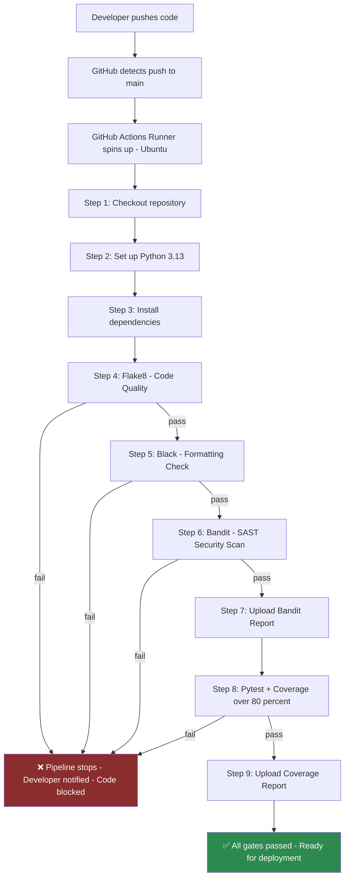

# SecurePipe

[](https://github.com/SreeragPramod/securepipe/actions/workflows/security-pipeline.yml)
[](https://www.python.org/downloads/)
[](https://github.com/psf/black)
[](https://github.com/PyCQA/bandit)
[](https://opensource.org/licenses/MIT)

> A secure CI/CD pipeline that automatically scans Python code for security vulnerabilities using GitHub Actions and Bandit — before code ever reaches production.
## Overview

SecurePipe demonstrates a secure CI/CD pipeline built to show DevSecOps principles in practice rather than in theory. The application itself — a small Python calculator and data-processing module — is intentionally simple. The pipeline around it is not.

Every push to this repository is automatically scanned for security vulnerabilities, checked for code style and formatting, tested against a full unit test suite, and gated on minimum test coverage — before the code would ever be considered ready for deployment.

This repository also documents a real vulnerability lifecycle: a hardcoded credential and a shell-injection flaw were intentionally introduced, automatically caught by the pipeline's Bandit scan, and then properly fixed — with the entire process visible in the commit history below.

## Architecture



## SDLC Mapping

| SDLC Phase | How This Project Addresses It |
|---|---|
| Requirements | Security requirements defined upfront: no hardcoded secrets, mandatory SAST scanning, minimum 80% test coverage |
| Planning | Folder structure, naming conventions, and tool selection (Bandit, Pytest, Flake8, Black) planned before any code was written |
| Design | Modules designed with input validation and fail-loud error handling from the start, not added afterward |
| Development | Secure coding practices applied directly: environment-variable-based secrets, `shell=False` subprocess calls, allowlist validation |
| Testing | 18 automated unit tests, including mocked subprocess calls and environment-variable edge cases, enforced via a coverage gate |
| Deployment | The GitHub Actions pipeline automatically blocks any commit that fails security, style, or test gates from being considered deployable |
| Maintenance | Dependabot monitors both Python dependencies and the GitHub Actions themselves for outdated or vulnerable versions, weekly |

## DevSecOps Workflow

This project applies the Shift-Left principle directly — every security and quality check runs at commit time, not after deployment.

| Gate | Tool | Catches |
|---|---|---|
| Code quality | Flake8 | Style violations, unused imports, common mistakes |
| Formatting | Black | Inconsistent code formatting across the codebase |
| Security (SAST) | Bandit | Hardcoded secrets, shell injection, insecure function usage |
| Correctness | Pytest + Coverage | Broken logic, untested code paths |
| Ongoing maintenance | Dependabot | Outdated or vulnerable dependencies, checked weekly |

### Proven in practice, not just configured

This pipeline isn't theoretical — the commit history demonstrates a real vulnerability being introduced, automatically caught, and fixed:

1. `data_processor.py` was added containing a hardcoded database password (Bandit rule B105) and a shell-injectable subprocess call (Bandit rule B602)
2. The pipeline's Bandit scan failed automatically, blocking the code and skipping all downstream steps, including the test suite
3. Both vulnerabilities were fixed — secrets moved to environment variables, `shell=True` replaced with `shell=False`, an explicit argument list, and a host allowlist
4. The pipeline re-ran and passed, with full test coverage added for the corrected module
## Technologies Used

| Category | Tool | Purpose |
|---|---|---|
| Language | Python 3.13 | Application code and test suite |
| CI/CD | GitHub Actions | Pipeline automation and orchestration |
| SAST | Bandit | Static security vulnerability scanning |
| Testing | Pytest | Unit test execution |
| Coverage | pytest-cov | Test coverage measurement and enforcement |
| Code Quality | Flake8 | PEP 8 style and error checking |
| Formatting | Black | Opinionated code formatting |
| Dependency Management | Dependabot | Automated dependency update monitoring |

## Installation

```bash
# Clone the repository
git clone https://github.com/SreeragPramod/securepipe.git
cd securepipe

# Create and activate virtual environment
python3 -m venv venv
source venv/bin/activate  # Windows: venv\Scripts\activate

# Install dependencies
pip install -r requirements.txt
```

## Usage

### Run the test suite
```bash
python -m pytest tests/ -v
```

### Run with coverage report
```bash
python -m pytest tests/ -v --cov=src --cov-report=term-missing
```

### Run Bandit security scan
```bash
bandit -r src/ -f txt
```

### Run code quality checks
```bash
flake8 src/ tests/ --max-line-length=88 --extend-ignore=E203
black --check src/ tests/
```

## Project Structure
  securepipe/
│
├── .github/
│ ├── workflows/
│ │ └── security-pipeline.yml # CI/CD pipeline definition
│ └── dependabot.yml # Automated dependency monitoring
│
├── src/
│ ├── init.py
│ ├── calculator.py # Core calculator module
│ └── data_processor.py # Data processing module (secure version)
│
├── tests/
│ ├── init.py
│ ├── test_calculator.py # Unit tests for calculator
│ └── test_data_processor.py # Unit tests for data processor
│
├── .gitignore # Excludes venv/, .env, cache files
├── LICENSE # MIT License
├── README.md # This file
└── requirements.txt # Pinned Python dependencies  

## Lessons Learned

- **Shift Left works in practice, not just theory** — Bandit caught both vulnerabilities at commit time, before any test or deployment stage ran. Finding them at that stage is orders of magnitude cheaper than finding them in production.
- **Coverage gates have real teeth** — Adding `--cov-fail-under=80` immediately surfaced that `data_processor.py` had zero test coverage, which I hadn't noticed manually. The gate found the gap automatically.
- **Module-level secret reads are untestable** — Reading environment variables at import time rather than inside functions makes code untestable. Moving reads inside functions was a small change with a large impact on both testability and correctness.
- **Mocking subprocess calls is a security practice, not just a testing convenience** — Mocking `subprocess.run` in tests prevents accidental network calls in CI, but the mock also serves as a regression test: if `shell=True` is ever reintroduced, the `assert_called_once_with` assertion fails immediately.
- **Pipeline-as-Code means security config is version-controlled** — Any change to the Bandit scan settings, coverage threshold, or any other gate is tracked in git history, reviewable, and reversible. Security configuration has an audit trail.

## Future Improvements

- **DAST integration** — Add OWASP ZAP as a dynamic analysis stage that scans a running instance of the application, complementing Bandit's static analysis
- **Docker containerisation** — Package the application in a container to ensure environment consistency between development, CI, and production
- **CodeQL** — Add GitHub's semantic code analysis engine for deeper vulnerability detection beyond pattern matching
- **Branch protection rules** — Enforce that the pipeline must pass before any pull request can be merged into main, making the security gate mandatory rather than advisory
- **Secret scanning** — Enable GitHub Advanced Security's secret scanning to detect any credentials accidentally committed to the repository
- **Pre-commit hooks** — Run Flake8 and Black locally before a commit is even created, catching style issues before they reach the pipeline

## License

This project is licensed under the MIT License. See the [LICENSE](LICENSE) file for details.
